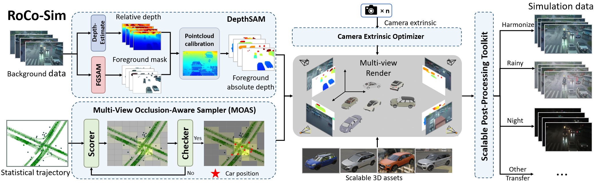
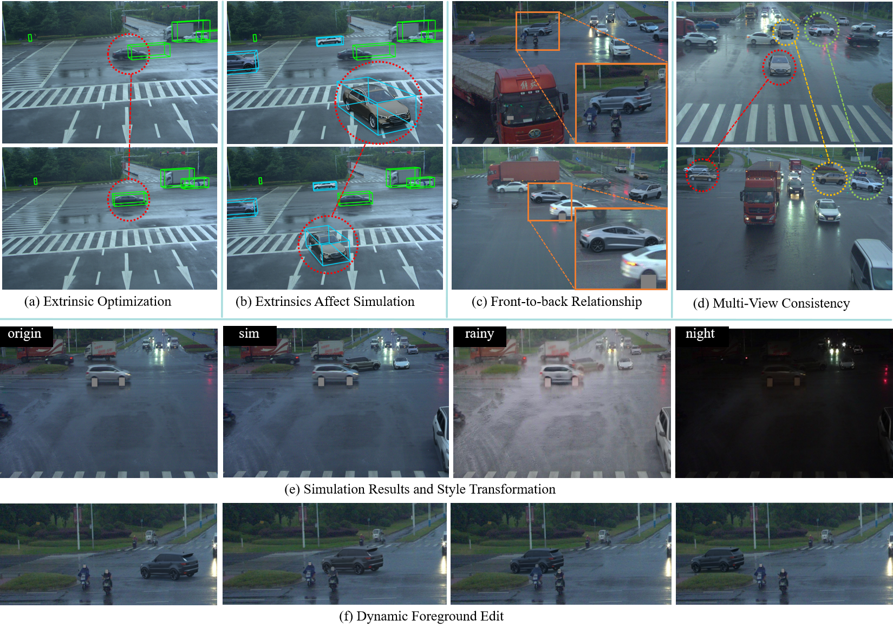
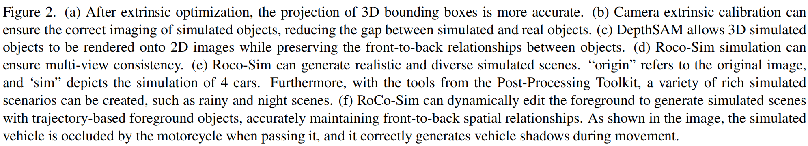
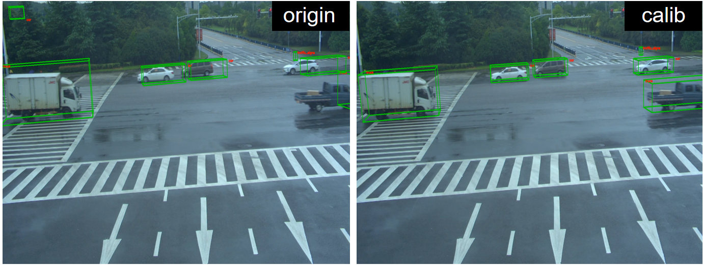
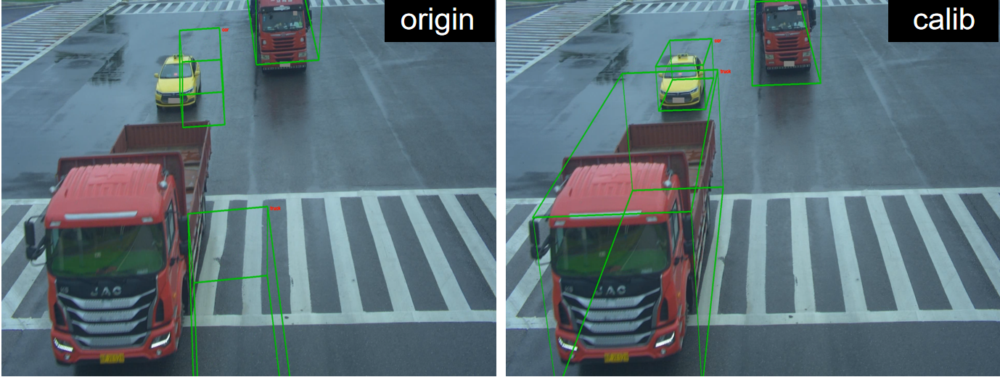
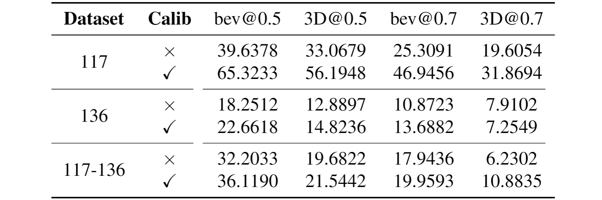
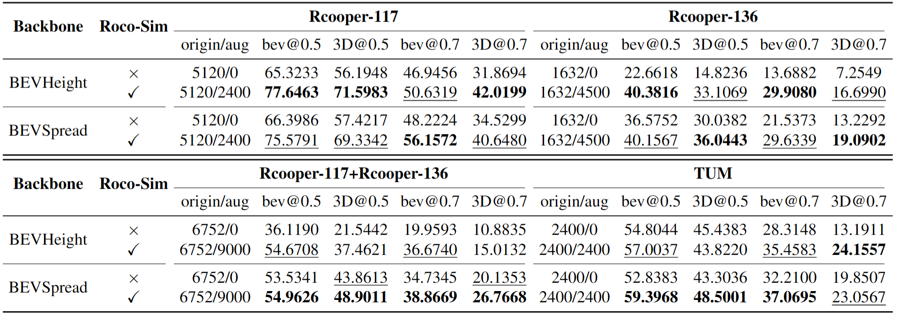
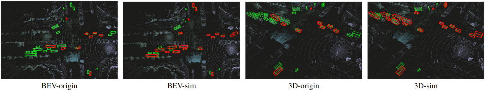
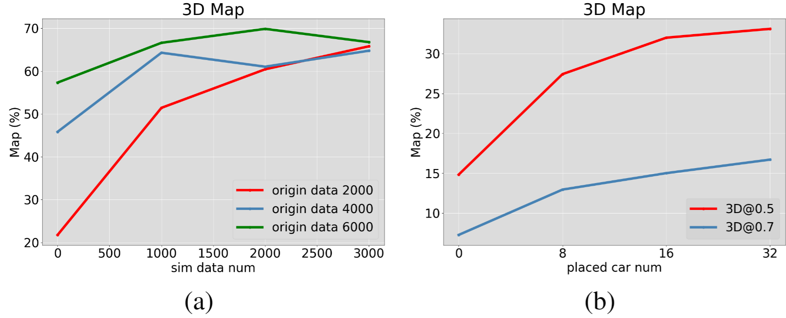

# RoCo-Sim

RoCo-Sim: Enhancing Roadside Collaborative Perception through Foreground Simulation

[paper](https://arxiv.org/pdf/2503.10410)

## Pipeline

   **3D-to-2D mapping and render foreground objects onto real 2D backgrounds**

- Camera Extrinsic Optimization ensures accurate 3D to 2D projection for roadside cameras
- Multi-View Occlusion-Aware Sampler (MOAS) determines the placement of diverse digital assets
- DepthSAM models foreground-background relationships
- Scalable Post-Processing Toolkit generates more realistic and enriched scenes through style transfer and other enhancements.

## Experiment

### overall

### Camera Extrinsic Optimizer

- Camera extrinsic optimization enables the 3D bounding box to be more accurately projected onto the 2D plane, and significantly enhances the performance of the model.

- Performance on RCooper-117 improves by **62.55%**

### DepthSAM

DepthSAM ensures that rendering adheres to front-to-back relationships and correct occlusion between objects

### Perception Evaluation

- RoCo-Sim significantly improves roadside 3D object detection, outperforming SOTA methods by **83.74%**on Rcooper-Intersection and **83.12%** on TUMTraf-V2X forAP70.

- The performance improvement for perception becomes more significant as:
  - The amount of simulation data increase
  - The number of simulated vehicles per image increase

