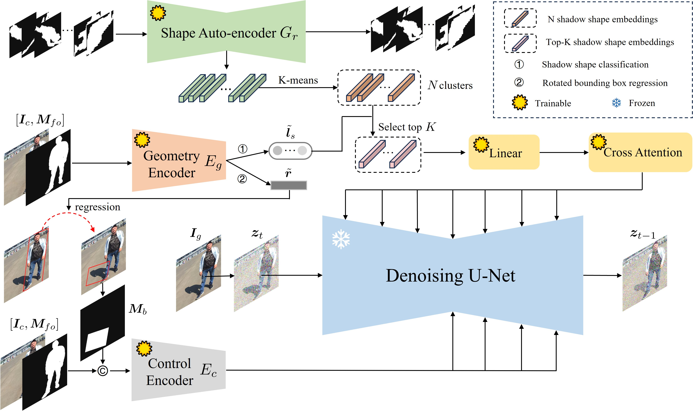

# Shadow Generation

Shadow generation model aims to generate plausible shadow for the inserted foreground in a composite image by using the following method GPSDiffusion. The generated shadow can make the composite image more realistic. By using this model, the shadow geometry details (e.g., location, scale, shape) are generally correct. When the shadow shape is complex, it is also possible to get one satisfactory result from multiple outputs.

> **Shadow Generation Using Diffusion Model with Geometry Prior**  [[code]](https://github.com/bcmi/GPSDiffusion-Object-Shadow-Generation) 
>

## Brief Method Summary

This model is built upon [GPSDiffusion](https://github.com/bcmi/GPSDiffusion-Object-Shadow-Generation) and trained on [DESOBAv2](https://github.com/bcmi/Object-Shadow-Generation-Dataset-DESOBAv2) dataset. In the first stage, the geometry encoder takes in the composite image and foreground mask to predict geometry priors which include rotated bounding box and shape embeddings information. In the second stage, the control encoder takes in the composite image, foreground mask and bounding box region mask to process the above two types of information for shadow generation with additional cross-attention layers. During testing, we add noise to the composite image to get the initial noise, which then goes through the denoising process to output the target image with foreground shadow.